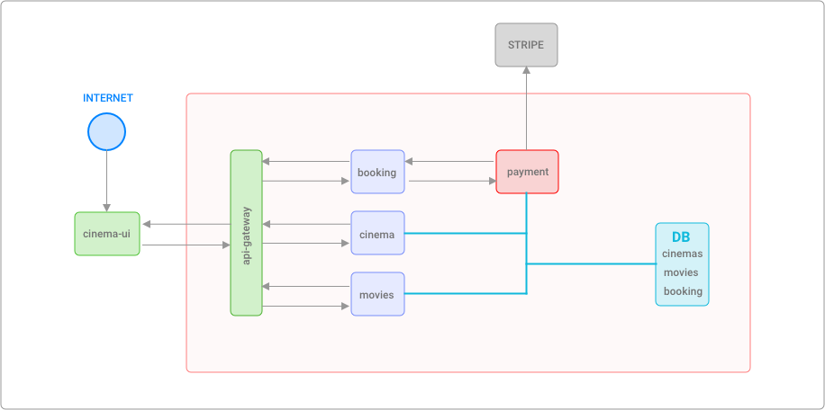

# Original Repo and Blog Post

### Repo

https://github.com/Crizstian/cinema-microservice

### Blog posts

- [Build a NodeJS cinema microservice and deploying it with docker (part 1)](https://medium.com/@cramirez92/build-a-nodejs-cinema-microservice-and-deploying-it-with-docker-part-1-7e28e25bfa8b)
- [Build a NodeJS cinema microservice and deploying it with docker (part 2)](https://medium.com/@cramirez92/build-a-nodejs-cinema-microservice-and-deploying-it-with-docker-part-2-e05cc7b126e0)
- [Build a NodeJS cinema booking microservice and deploying it with docker (part 3)](https://medium.com/@cramirez92/build-a-nodejs-cinema-booking-microservice-and-deploying-it-with-docker-part-3-9c384e21fbe0)
- [Build a NodeJS cinema microservice and deploying it with docker (part 4)](https://medium.com/@cramirez92/build-a-nodejs-cinema-api-gateway-and-deploying-it-to-docker-part-4-703c2b0dd269#.en6g5buwl)
- [Deploy a Nodejs microservices to a Docker Swarm Cluster (Docker from zero to hero)](https://medium.com/@cramirez92/deploy-a-nodejs-microservices-to-a-docker-swarm-cluster-docker-from-zero-to-hero-464fa1369ea0#.548ni3uxv)

# Cinema Apps Deployment

The cinema apps deployment is a simple exercise that illustrates how easy is to deploy a microservice architecture to Kubernetes when using Shipa.

The whole suite is composed by 6 NodeJS applications interacting between each other to provide different sets of data that combined together populate a given UI. Each application talks to a different MongoDB database to retrieve the desired information and exposes REST API endpoints to be consumed by the UI. The UI requests data from different endpoints and offer a simple interface to users to see the information generated in these independent apps.

The whole suite is defined by the following applications:

- Movies <- REST API that connects to a MongoDB database and retrieves a list of movies
- Cinema Catalog <- REST API that connects to a MongoDB database and retrieves a list of movie theaters
- Payment <- REST API that connects to a third-party payment service (Stripe) and retrieves results of payment operations
- Notification <- REST API that receives details of a certain transaction and sends them to user by email (fake emailing process)
- Booking <- REST API that connects to Payment and Notifications to register purchase of certain movies.
- UI (future) <- Web application that talks to all previous services and offers a cinema like e-commerce experience to book movies.

Potentially the whole suite can be arranged to achieve the following scenario from a network policies perspective



## Databases - MongoDB Service

Some of the previous applications require a database to persist/read information that will be exposed later on by the API; therefore, having access to a MongoDB service is required.

**Shipa Testing MongoDB**
Host: 34.83.231.158
Port: 27017
User: shipa
Pass: shipa2020

Log into the service posted above and create the DBs required for every case

### Movies DB

```sh
mongo -u shipa 34.83.231.158:27017

# Verify if databases already exist
show dbs

# Create your "movies" DB
use movies

# Create a user for the DB
db.createUser(
   {
     user: "shipau",
     pwd: "shipapass"
     roles: [
       { role: 'userAdmin', db: 'movies' },
       { role: 'dbAdmin', db: 'movies' },
       { role: 'readWrite', db: 'movies' }
       ]
   }
)

# Exit the current user and log with the recently created one
exit

mongo -u shipau 34.83.231.158:27017/movies

# Insert some DB records
db.movies.insertMany([
  {"id" : "1", "title" : "Assasins Creed", "runtime" : 115, "format" : "IMAX", "plot" : "Lorem ipsum dolor sit amet", "releaseYear" : 2017, "releaseMonth" : 1, "releaseDay" : 6 , poster: 'assasins-creed.jpg'}
  {"id" : "2", "title" : "Gladiator", "runtime" : 124, "format" : "IMAX", "plot" : "Lorem ipsum dolor sit amet", "releaseYear" : 2017, "releaseMonth" : 1, "releaseDay" : 13, poster: 'gladiator.jpg' }
  {"id" : "3", "title" : "xXx: Reactivado", "runtime" : 107, "format" : "IMAX", "plot" : "Lorem ipsum dolor sit amet", "releaseYear" : 2017, "releaseMonth" : 1, "releaseDay" : 20, poster: 'reactive.jpg' }
  {"id" : "4", "title" : "Resident Evil: Capitulo Final", "runtime" : 107, "format" : "IMAX", "plot" : "Lorem ipsum dolor sit amet", "releaseYear" : 2017, "releaseMonth" : 1, "releaseDay" : 27, poster: 'resident-evil.jpg' }
  {"id" : "5", "title" : "Moana: Un Mar de Aventuras", "runtime" : 114, "format" : "IMAX", "plot" : "Lorem ipsum dolor sit amet", "releaseYear" : 2016, "releaseMonth" : 12, "releaseDay" : 2, poster: 'moana.jpg' }
])
```

### Cinema DB

Required DB only if the endpoint to list movie theaters will be tested.

```sh
mongo -u shipa 34.83.231.158:27017

# Verify if databases already exist
show dbs

# Create your "cinema" DB
use cinema

# Create a user for the DB
db.createUser(
   {
     user: "shipau",
     pwd: "shipapass",
     roles: [
       { role: 'userAdmin', db: 'cinema' },
       { role: 'dbAdmin', db: 'cinema' },
       { role: 'readWrite', db: 'cinema' }
       ]
   }
)

# Exit the current user and log with the recently created one
exit

mongo -u shipau 34.83.231.158:27017/cinema

# Insert some DB records

//Install mongo-tools
sudo apt install mongo-tools

// Locally
mongoimport --jsonArray --db cinema --collection docs --file ~/your_path/cinema-catalog-service/src/mock/countries.json
mongoimport --jsonArray --db cinema --collection docs --file ~/your_path/cinema-catalog-service/src/mock/states.json
mongoimport --jsonArray --db cinema --collection docs --file ~/your_path/cinema-catalog-service/src/mock/cities.json
mongoimport --jsonArray --db cinema --collection docs --file ~/your_path/cinema-catalog-service/src/mock/cinemas.json

// OVER VM
// Copy the backup JSON files into the VM
mongoimport --username USER --password PASS --db cinema --collection countries --jsonArray --file ./countries.json
mongoimport --username USER --password PASS --db cinema --collection states --jsonArray --file ./states.json
mongoimport --username USER --password PASS --db cinema --collection cities --jsonArray --file ./cities.json
mongoimport --username USER --password PASS --db cinema --collection cinemas --jsonArray --file ./cinemas.json
```

### Booking DB

```sh
mongo -u shipa 34.83.231.158:27017

# Verify if databases already exist
show dbs

# Create your "movies" DB
use booking

# Create a user for the DB
db.createUser(
   {
     user: "shipau",
     pwd: "shipapass",
     roles: [
       { role: 'userAdmin', db: 'booking' },
       { role: 'dbAdmin', db: 'booking' },
       { role: 'readWrite', db: 'booking' }
       ]
   }
)

# Exit the current user and log with the recently created one
exit
```

## Applications

To create/deploy all the applications required by this suite, please follow the instructions placed below.

As a summary, all applications will involve:

Once:

- Creating a new pool to host your applications
- Adding the new pool to an existing cluster

Per app:

- Creating a Shipa application as a shell for your app
- Adding some ENV variables to them to connect them to databases/third-party services (Stripe)
- Deploying the application from a Docker hub image

**Note:** Consider that any of the steps can be achieved by using Shipa's Dashboard directly

### Pre-app creation steps

- Create a new pool with the name an ingress of your preference

```sh
shipa pool add pool-istio --provisioner kubernetes --ingress istio
```

- Add the new pool to the default Shipa cluster or the cluster of your preference

```sh
shipa cluster update shipa-cluster --pool shipa-pool --pool pool-istio
```

### Movies

- Create an application called `movies` (https://hub.docker.com/repository/docker/dechegaray/movies)

```sh
shipa app create movies --team admin --pool pool-istio

shipa env-set -a movies DB_SERVER=34.83.231.158:27017 DB_USER=shipau DB_PASS=shipapass DB=movies

shipa app deploy -a movies -i dechegaray/movies
```

### Cinema catalog

- Create an application called `cinema` (https://hub.docker.com/repository/docker/dechegaray/cinema)

```sh
shipa app create cinema --team admin --pool pool-istio

shipa env-set -a cinema DB_SERVER=34.83.231.158:27017 DB_USER=shipau DB_PASS=shipapass DB=cinema

shipa app deploy -a cinema -i dechegaray/cinema
```

### Notifications

- Create an application called `notifications` (https://hub.docker.com/repository/docker/dechegaray/notifications)

```sh
shipa app create notifications --team admin --pool pool-istio

shipa app deploy -a notifications -i dechegaray/notifications
```

### Payment

- Create an application called `payment` (https://hub.docker.com/repository/docker/dechegaray/payments)

```sh
shipa app create payment --team admin --pool pool-istio

shipa env-set -a payment DB_SERVER=34.83.231.158:27017 DB_USER=shipau DB_PASS=shipapass DB=booking STRIPE_SECRET=your_secret STRIPE_PUBLIC=your_token

shipa app deploy -a payment -i dechegaray/payments
```

### Booking

- Create an application called `booking` (https://hub.docker.com/repository/docker/dechegaray/booking)

```sh
shipa app create booking --team admin --pool pool-istio

shipa env-set -a booking DB_SERVER=34.83.231.158:27017 DB_USER=shipau DB_PASS=shipapass DB=booking NOTIFICATION_API_HOST=your_app_endpoint PAYMENT_API_HOST=your_app_endpoint

shipa app deploy -a booking -i dechegaray/booking
```

**Optional:**

To give more security to applications handling sensitive data, you can set your own network policies so `payment` does not allow traffic from any other app different than `booking` as its ingress. If that's the case, you can use Shipa's internal DNS to connect `payment` and `booking` together:

- Re-set your ENV variable and use Shipa's internal DNS as the app endpoint

```sh
shipa env-set -a booking PAYMENT_API_HOST=app-payments.pool-istio.svc:3000
```

### API Gateway

- Create an application called `api-gateway` (https://hub.docker.com/repository/docker/dechegaray/api-gateway)

```sh
shipa app create api-gateway --team admin --pool pool-istio

shipa env-set -a api-gateway API_BOOKING=you-booking-endpoint API_MOVIES=you-movies-endpoint API_CINEMA=you-cinema-endpoint

shipa app deploy -a api-gateway -i dechegaray/api-gateway
```

### UI

- Create an application called `ui-cinema` (https://hub.docker.com/repository/docker/dechegaray/ui-cinema)

```sh
shipa app create ui-cinema --team admin --pool pool-istio

shipa env-set -a ui-cinema REACT_APP_API_SERVER=api-gateway-endpoint

shipa app deploy -a ui-cinema -i dechegaray/ui-cinema
```

## Testing the applications

1. From the UI

- Find the public endpoint generated by shipa for `ui-cinema`
- Open the link in the browser
- Evaluate that the API gateway is returning actual data
  - Movies should be loaded
  - Cinemas should be accessible
  - Booking should trigger a request when selecting a movie

2. Directly from REST API endpoints

- Movies -> Run a GET request to `{APP_ENDPOINT}/movies`
- Cinema -> Run a GET request to `{APP_ENDPOINT}/cinemas/588ac3a02d029a6d15d0b5c4`

```json
{
  "cityd": "588ababf2d029a6d15d0b5bf"
}
```

- Payments -> Run a POST request to `{APP_ENDPOINT}/payment/makePurchase`

```json
{
  "paymentOrder": {
    "userName": "daniel",
    "currency": "USD",
    "number": "4111111111111111",
    "cvc": 342,
    "exp_month": 10,
    "exp_year": 2022,
    "amount": 100,
    "description": "Fake purchase"
  }
}
```

- Booking -> Run a POST request to `{APP_ENDPOINT}/booking`

```json
{
  "user": {
    "name": "Daniel",
    "lastName": "Echegaray",
    "email": "test@test.com",
    "creditCard": {
      "number": "4242424242424242",
      "cvc": "123",
      "exp_month": "11",
      "exp_year": "2023"
    },
    "membership": "7777888899990000"
  },
  "booking": {
    "city": "Morelia",
    "cinema": "Plaza Morelia",
    "movie": {
      "title": "Assasins Creed",
      "format": "IMAX"
    },
    "schedule": "Fri Jan 8 2021 23:03:48 GMT-0500 (Eastern Standard Time)", // Make sure the date is a FUTURE date
    "cinemaRoom": 7,
    "seats": ["45"],
    "totalAmount": 15
  }
}
```
